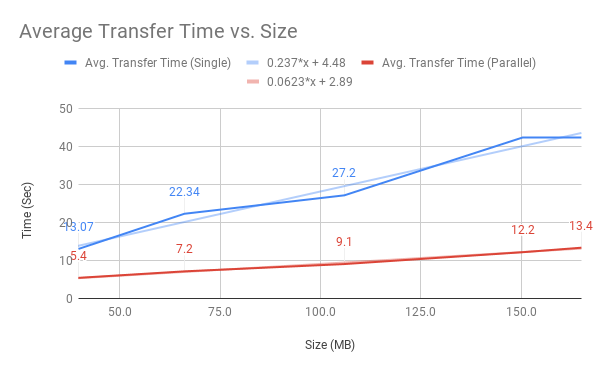

# Parallel Secure Copy (`pscp`)

Bash script utility for running secure copy of a file in chunks in parallel.

## Installation

From your favorite terminal, run:

```
curl -s https://raw.githubusercontent.com/yinonavraham/pscp/master/install.sh | bash
```

## Usage

```
pscp [OPTIONS] FILE DEST
```

### Example

In order to copy a local file named `myfile` to path `/path/to/` in a remote host named `some-other-host`, authenticating as `myuser` (based on SSH key), use:
```
pscp myfile myuser@some-other-host:/path/to/
```

### Basic Options

* **`--help`**  
  Show usage help. Use this to inspect all options the utility supports.
* **`--threads=<value>`**
  Specify the number of chunks to split the file to.
  These chunks are then sent in parallel.
* **`--verbose`**  
  Print verbose output of the actions done by the script.

### Implementation

The script performs the following main operations:

1. Create a temporary local transaction directory. 
   This directory is used to save all temporary files created during the transfer.
1. Split the source file to chunks (according to the threads value).
   These chunk files are saved in the local transaction directory.
1. Create a temporary transaction directory in the remote host.
1. Start background processes to transfer each chunk file (using `scp`). 
   Each such process appends a line to a control file (saved in the local transaction directory).
1. Wait for all background processes to finish.
   This is done by polling on the control file.
1. Assemble the file in the remote host from all the chunk files.
1. Verify the checksum of the source file and the remote file is the same.
1. Cleanup the transaction directories (local and remote).

## Statistics

This script started as an experiment. 
As part of the experiment files of various sizes were copied between AWS instances, from Frankfurt DE to Oregon US.
The same files were copied 10 times using `scp` (i.e. single process) and 10 times using `pscp` with default threads (i.e. 10 parallel `scp` processes, each transfers a single chunk).
The results, as can be seen below, transfer time in parallel (using `pscp`) is approximately 30%-40% of the time compared to using `scp`.

  

  

## Notes

There are several overheads which are not included in the calculations above: 
1. Splitting the file in the source and re-assembling it in the destination.  
   This is a mandatory overhead, but it usually takes no more than 2-3 seconds.  
1. In order to verify that the file was transferred successfully, the script performs a checksum verification.
   It calculates the checksum (SHA-1) of the file in the source, the checksum of the file in the destination and compares them.
   This verification also takes ~2 seconds, but can be disabled using the `--no-verify` flag.
1. The script cleans up temporary files (mainly the chunks and a control file) from both the source and the destination.
   This cleanup also takes ~2 seconds, but can be disabled using the `--no-cleanup` flag.

## Contributing

Contributions of all kinds are more than welcome (bug fixes, new features, documentation, etc.).  
Feel free to create an issue, or even better - open a pull request.
